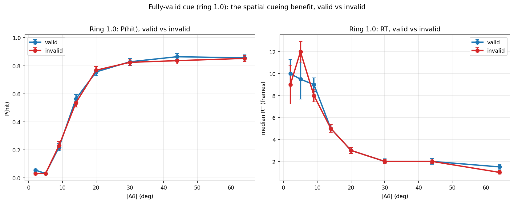
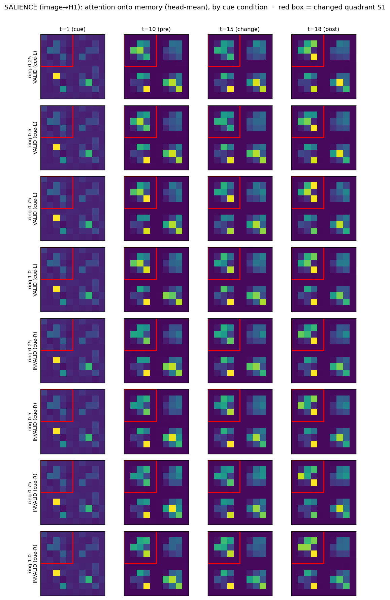

## Abstract

A central question in the study of visual attention is how an agent combines bottom-up sensory evidence with top-down expectation to decide *when* something in the world has changed. We study a compact recurrent vision agent trained purely by reinforcement on a Posner-style cued change-detection task in which a spatial cue predicts where a change will occur, the cue's colour sets the reward at stake, and the magnitude of the change varies from trial to trial. The agent's perceptual core is a pair of parallel attention streams that both read the current image but resolve it against different internal memories: a **salience** stream that keeps the raw image on its residual path and compares it against a fast sensory memory, and a **top-down** stream whose residual path is a slow integrated memory that the current image can only re-gate. We show that the trained agent produces a graded psychometric function of change magnitude and a strongly value-directed policy — it allocates detection effort by the reward at stake, to the point of abandoning low-value trials — while keeping a near-zero false-alarm rate. Notably, although the agent represents the spatial cue's location and reliability perfectly, it derives essentially no behavioural benefit from the cue: with the change location controlled, validly and invalidly cued changes are detected equally well at every cue reliability, because the agent locks onto the change wherever it occurs. Using a faithful, bias-injectable reconstruction of the two attention streams we then dissect the underlying computation: we map where and when each stream attends, decode the task variables linearly held in each memory, and causally perturb the streams to establish which one carries the decision. The picture that emerges is a clean division of labour — the **top-down** stream is a change-locked detector that, as causal perturbation confirms, drives the press decision, while the grounded **salience** stream supplies a cue-shaped spatial prior and controls the value function's certainty. We close by characterising the agent's distributional critic, which is well calibrated and value-directed.

## 1. Introduction

Detecting change in a cluttered visual scene is one of the canonical problems of perception. The difficulty is not merely sensory: the observer must hold a representation of the recent past, compare it against the present, and decide — under uncertainty and time pressure — whether the difference is large enough to act on. Decades of psychophysics have shown that this process is shaped by attention. A spatial cue that predicts *where* a change is likely to occur improves accuracy and speeds responses at the cued location, and the size of that benefit scales with the cue's reliability. When different locations or outcomes carry different rewards, attention is further drawn toward the valuable ones — the phenomenon of value-directed attention.

How might these signatures arise in a system that has to learn the task from reward alone, with no supervision about where to look or when to respond? We address this with a model organism: a small recurrent neural network that receives a stream of images, maintains an internal memory, and emits at each step a binary decision — *wait* or *press* — trained end-to-end by reinforcement learning. The model is deliberately minimal so that its internal computations can be read out exhaustively rather than merely summarised.

The architecture studied here is built around a specific hypothesis about how bottom-up and top-down information should be combined. Rather than a single attention operation, the model runs **two parallel cross-attention streams** on every frame. Both query with the current image, but they differ in what they read and, crucially, in what they keep on their residual path:

- The **salience** stream keeps the *raw image* on its residual and attends from the image into a fast sensory memory of the recent past. Because the image is preserved, this stream is always grounded in the present input; its attention component acts as a comparison between now and the recent past — a bottom-up change signal.
- The **top-down** stream keeps a *slow integrated memory* on its residual and lets the current image attend into that same deep memory. Because the residual is the memory and not the image, the current frame can only **re-gate** the memory readout — it cannot inject new content. This is the strict, query-gated bottleneck.

The two stream outputs are concatenated and read by the policy and value heads. The design intent is a fallback structure: the grounded salience stream guarantees that the agent never loses contact with the image (a failure mode that strict memory-only bottlenecks are prone to, where the agent collapses to always waiting), while the top-down stream provides a controllable, expectation-driven gate.

This paper asks what such a system actually learns, and how the two streams divide the labour of the task. We proceed in five steps. First, we establish that the trained agent reproduces the behavioural hallmarks of cued, value-weighted change detection. Second, we map the spatial and temporal allocation of attention in each stream. Third, we ask what task variables are linearly decodable from each internal memory and from each stream's output, and when those representations come online. Fourth, we causally manipulate the two attention streams — artificially inflating or suppressing their attention scores — to identify which stream carries the decision and which only shapes value and uncertainty. Fifth, we characterise the agent's distributional value function. Throughout, our analyses rest on a reconstruction of the model's attention that is verified to reproduce the trained network's computation to numerical precision, so that every causal manipulation acts on the real circuit.

### 1.1 Background and related work

The task is a reinforcement-learning rendering of the cued change-detection paradigm, in which a pre-cue indicates the likely location of an upcoming target and the observer must report its appearance. The behavioural phenomena we look for — improved sensitivity and faster responses at validly cued locations, scaling with cue reliability, and modulation by reward — are robust findings in human and animal attention research. Architecturally, the model belongs to a family of recurrent attention networks in which a transformer-style attention operation is wrapped in a recurrence so that the keys and values can be the network's own evolving memory, allowing top-down feedback from one timestep to shape perception at the next. The novelty examined here is the explicit *split* of that operation into a grounded bottom-up stream and a gated top-down stream that run in parallel and are read jointly.

## 2. Methods

### 2.1 The change-detection environment

Each trial is a short movie of $50\times50$ RGB frames lasting 29 steps. At $t=1$ a coloured cue appears in one of two locations (a top-left or a bottom-right disc-and-ring); the ring's completeness encodes the cue's **reliability** (the *proportion*, one of $\{0.25, 0.5, 0.75, 1.0\}$) and the cue's **colour** encodes the reward at stake on a correct hit (red $=5$, green $=3$, blue $=1$). From $t=3$ onward the display shows four oriented Gabor patches, one in each quadrant, each jittered by orientation noise every frame. On half of trials, at a change time drawn uniformly from $t\in[11,25]$, one Gabor's orientation steps by $\Delta\theta\in[-64^\circ, +64^\circ]$ and remains changed for the rest of the trial; on the other half no change occurs. The cue is *valid* with probability equal to the displayed proportion: on a change trial, with that probability the change occurs in the cued quadrant, otherwise in a random uncued quadrant.

The agent emits *wait* or *press* at each step. Pressing before the change ends the trial with zero reward (a false alarm / premature press); pressing at or after the change on a change trial yields the cue-colour reward (a hit); correctly withholding the press through the end of a no-change trial also yields the cue-colour reward. Reaction time is defined on hits as the number of frames between the change and the press. This payoff structure makes *waiting* the safe default and places the entire burden of performance on detecting the change quickly without pressing early.

### 2.2 Architecture

The agent is conv-free. Each frame is cut into a $10\times10$ grid of $5\times5$ patches and embedded by a per-patch MLP into $N=100$ tokens of width $d=128$. The perceptual core is the dual-stream encoder. Writing $X$ for the current patch tokens and $H_1, H_2$ for two per-token recurrent memories carried from the previous frame, each frame computes

$$Z_\text{sal} = X + \mathrm{attn}(Q{=}X,\; K{=}V{=}H_1) + \mathrm{FFN}(\cdot), \qquad \text{(salience; residual } X)$$
$$Z_\text{td} = H_2 + \mathrm{attn}(Q{=}X,\; K{=}V{=}H_2) + \mathrm{FFN}(\cdot), \qquad \text{(top-down; residual } H_2)$$

with eight attention heads per stream and a shared positional embedding added to the memory keys. The memories are then updated by two per-token LSTM cells: the sensory memory is written from the raw image, $H_1 \leftarrow \mathrm{LSTM}_1(X)$, and the deep memory from the salience output, $H_2 \leftarrow \mathrm{LSTM}_2(Z_\text{sal})$. Thus image content reaches the deep memory only through the salience stream, and the two streams interact across time through $H_2$.

The policy and value heads read the **two transformer outputs**, not the LSTM states: $[Z_\text{sal} \,\Vert\, Z_\text{td}]$ is laid out as a $(2d)\times N$ array and passed through a stack of strided 1-D convolutions over the token (spatial) axis, then flattened and linearly projected. The actor produces two logits (wait/press); the distributional critic produces 51 quantiles per action, and the state value is the policy-weighted expectation over actions. The full model has 1,097,320 parameters. It is trained by a policy-gradient actor loss combined with a distributional (quantile) critic and prioritised episode replay; a short burn-in phase forces waiting while the critic warms up. No part of the training signal tells the agent where to attend or when to press.

### 2.3 Faithful attention extraction and intervention

Every mechanistic analysis is built on a hand-written reconstruction of the dual-stream step that reproduces each stream's eight-head cross-attention from the network's own projection weights, returning the full $(B,\text{heads},N,N)$ attention tensors and allowing an additive bias to be injected into the pre-softmax logits of either stream before the softmax. In evaluation mode (dropout disabled) this reconstruction reproduces the stock network's two stream outputs, both recurrent memories, and the actor and critic readouts to a maximum absolute deviation below $10^{-6}$ at zero bias, so the attention we visualise is the attention the network uses and the causal perturbations act on the real circuit. Because the image queries the memory (rather than the image being a key), the spatially meaningful attention map is the weight each **memory location** receives, averaged over the image queries; memory row $i$ corresponds to patch position $i$, so these maps live on the $10\times10$ grid and split cleanly into the four Gabor quadrants.

### 2.4 Behavioural, decoding, causal, and value analyses

We measure behaviour by rolling out the greedy policy on forced-condition trials and computing hit rate, premature-press rate, and reaction time as functions of change magnitude, cue validity, and cue value. We characterise internal representations by linearly decoding (cross-validated, against shuffled-label controls) each task variable from each memory and stream output at every timestep, using both the spatially-collapsed token mean and per-quadrant pooling. We establish causal roles by sweeping an additive attention bias over each stream's keys (globally and per quadrant) and reading off the change in the decision (hit rate, premature rate, reaction time) versus the change in value and uncertainty (the press-versus-wait value advantage, the critic's distributional spread, and the policy entropy). Finally we assess the value function by comparing predicted state values against realised Monte-Carlo returns and by tracking the critic's distributional spread as a function of evidence. All analyses use a single frozen snapshot of the trained agent.

## 3. Results

All results are from a single frozen snapshot of the trained agent. Under its own greedy policy on a battery of randomly-sampled trials the agent detects changes well above chance while almost never responding prematurely: on change trials it presses on $63\%$ of trials, on no-change trials it correctly withholds on $99\%$, the premature-press rate is effectively zero, the median reaction time is two frames, and the mean reward ($2.70$) sits near the achievable ceiling for this stochastic task. These aggregates already establish two things: the grounded salience stream prevents the always-wait collapse that strict memory-only bottlenecks fall into, and the agent has learned the cautious, evidence-gated policy the payoff structure rewards.

### 3.1 Behavioural signatures of spatial and value-directed attention

We separate three questions that the cue conflates — how detection depends on the physical signal, on the spatial cue (its validity and its displayed reliability), and on the cue's value — and report each explicitly. Unless noted, trials fix the cue on the left so the cued quadrant is the top-left location S1, hold the change at $t=15$, randomize the cue colour so value marginalizes out, and use $250$ trials per cell; "valid" means the change occurs in the cued quadrant and "invalid" means it occurs in one of the three uncued quadrants.

**The psychometric and chronometric functions.** Detection is a graded function of the physical signal. As the orientation change $|\Delta\theta|$ grows from $2^\circ$ to $64^\circ$, the hit rate rises monotonically from near zero to $\approx 0.85$ — a clean psychometric function with a half-maximal threshold near $14^\circ$ — and the median reaction time falls in lockstep from eight frames at threshold to two frames for large changes (Figure 1, left). Bigger changes are both more often detected and detected faster, the chronometric signature of evidence accumulation. This shape is the same at every displayed cue reliability: sweeping the ring proportion across $\{0.25, 0.5, 0.75, 1.0\}$ leaves the valid-trial psychometric and chronometric curves essentially superimposed (Figure 2), with thresholds and asymptotes that differ by no more than the sampling noise. The agent's sensitivity to the physical change does not depend on how reliable the cue claims to be.

**The spatial cueing benefit is negligible, at every reliability.** This is the question our first draft answered too quickly. Comparing valid against invalid trials *within each displayed reliability* (Figure 3), the two psychometric curves and the two chronometric curves lie on top of one another at all four proportions: at $|\Delta\theta|=14^\circ$ the valid-minus-invalid hit difference is $+0.01$, $-0.02$, $-0.03$, and $+0.03$ for rings $0.25$ through $1.0$ — scatter around zero, not a benefit — and the asymptotic hit rates are likewise indistinguishable ($0.83$–$0.89$ in both conditions). Even for a fully valid cue (ring $1.0$), where a reliability-reading agent should show its largest spatial benefit, valid and invalid detection are statistically the same across the whole magnitude range (Figure 4). The agent therefore derives essentially no behavioural advantage from *where* the cue points and does not scale any such advantage with the cue's stated reliability. As we show in Sections 3.2 and 3.4, this is the behavioural footprint of a detector that locks onto the change wherever it occurs: a bottom-up mechanism that makes the spatial cue largely redundant for accuracy. (A small valid advantage of a few points does appear when the cue *position* is randomized rather than fixed, an artefact of the agent detecting changes slightly better in the two quadrants where cues can appear; it is absent here, with location controlled.)

**Value, by contrast, dominates behaviour.** Holding the change near threshold and varying only the cue colour, which sets the reward at stake, the agent detects the change on $78\%$ of green ($v=3$) and $77\%$ of red ($v=5$) trials but only $8\%$ of blue ($v=1$) trials, and its reaction time on the rare blue hits is more than double that on green or red (Figure 1, right). The agent has, in effect, learned to *abandon* low-value trials: it does not spend detection effort where the reward does not justify the risk of a premature press. This is value-directed attention in its strongest form, and it is the behavioural modulation the agent actually relies on — value, not spatial cueing. It foreshadows the structure of the value function (Section 3.5).

![Detection depends on the physical signal and on value, but not on the spatial cue. Left: hit rate (solid, left axis) and median reaction time (dashed, right axis) versus change magnitude $|\Delta\theta|$, for valid versus invalid cues at ring $0.75$ — a graded psychometric/chronometric function with the valid and invalid curves nearly identical. Middle: hit rate at the cued location versus the displayed cue reliability — flat, a null reliability-scaling. Right: hit rate by cue value (colour) at a near-threshold magnitude — the agent abandons low-value (blue) trials and detects high-value (green/red) changes well.](figs/fig_behaviour.png){width=100%}

{width=100%}

{width=100%}

{width=92%}

### 3.2 How attention is allocated across the two streams

Because the image queries memory in both streams (the image is the query, the memory rows are the keys), the spatially-resolved quantity is how much attention each *memory location* receives, averaged over the image queries; memory row $i$ corresponds to patch position $i$, so these maps live on the same $10\times10$ grid as the four Gabor quadrants and split into the four quadrants S1–S4. We compute them under a forced-wait policy at a large change magnitude ($|\Delta\theta|=64^\circ$, change at S1, $t=15$) for all eight cue conditions — every displayed reliability $\{0.25,0.5,0.75,1.0\}$ crossed with a valid cue (left, cued quadrant $=$ S1) and an invalid cue (right, cued quadrant $=$ S4). The maps reveal a clean and consistent division of labour between the two streams (Figures 5–8).

**The top-down stream is a change-locked detector, identically in all eight conditions.** Before the change its attention onto memory is distributed with only a slight bias toward the cue-able quadrants; at change onset it snaps sharply onto the changed quadrant S1, with the attention mass on S1 rising from $\approx 0.28$ to $\approx 0.61$ within three frames. The spatial maps make this literal: in every condition the top-down attention is diffuse through $t=15$ and then lights up the red-boxed S1 block at $t=18$ (Figure 7). Crucially the lock is the same whether S1 is the cued quadrant (valid, cue-left) or an uncued one (invalid, cue-right), and the same at every displayed reliability — the changed-quadrant time-courses for all eight conditions superimpose after the change (Figure 6, right). The top-down readout is therefore driven by the change itself, not by the cue, and a majority of its eight heads participate in the lock (Figure 5, right).

**The salience stream carries a cue-shaped spatial prior.** Its attention onto memory tracks the cued location *before* any change — elevated on the cued quadrant (S1 on valid/cue-left trials, S4 on invalid/cue-right trials) from cue onset through the pre-change period — and shifts only weakly toward the changed location afterward (Figure 8; Figure 6, left). The salience heads are heterogeneous, several holding a persistent cue-aligned spatial profile rather than the synchronous post-change snap seen in top-down (Figure 5, left). This is the attentional counterpart of the behavioural result of Section 3.1: the salience stream *does* represent where the cue points, but because the top-down detector finds the change wherever it is, that spatial prior buys the agent little accuracy. The two streams split the computation the task affords: salience maintains *where the cue says to expect* a change, while top-down delivers the sharp *when-and-where it actually happened* signal that the decision reads.

{width=100%}

{width=100%}

{width=58%}

{width=58%}

### 3.3 What the recurrent memories and stream outputs encode

We trained cross-validated linear decoders for each task variable from each internal representation at every timestep, comparing the spatially-collapsed token mean of each memory and stream output against their per-quadrant-pooled counterparts, all against shuffled-label controls (Figure 9).

Three variables are represented essentially perfectly. The cue's **colour** (hence its value) is decodable at ceiling ($1.00$ balanced accuracy) from the moment the cue appears, as is the cue's **reliability** — the displayed ring proportion decodes at $1.00$ as both a four-way category and a continuous regressor. This last result is a clean dissociation: the agent *represents* the cue's reliability perfectly yet does not *use* it to scale its behaviour (the flat validity-scaling of Section 3.1). The information is present in the latents; the policy simply does not condition on it. The network also maintains a near-perfect internal **clock**: absolute trial time is decodable from the pooled deep memory at $R^2=0.994$, which the agent needs in order to respect the change-time window and avoid premature presses.

The change variables are decodable but more weakly and, crucially, *spatially*. The changed **location** decodes at $0.72$ (four-way, chance $0.25$) — but only from per-quadrant-pooled memory; the spatially-collapsed token mean of every representation decodes location near chance ($\approx 0.45$). Location is therefore held as a spatial pattern across the token grid, not as a pooled code, which is precisely why the readout heads convolve over the token axis rather than averaging it. Among the representations, the changed location is best recovered from the per-quadrant **sensory memory** $H_1$ ($0.72$) and the deep memory $H_2$ ($0.69$), and less well from the transformer stream outputs ($\approx 0.48$) — the spatial "what changed where" lives in the recurrent memory written from the image, consistent with $H_1$ being the grounded sensory trace. Change **magnitude** and **onset time** are moderately decodable ($R^2=0.47$ and $0.57$). Together the decoders show an agent that perfectly registers the cue's instructions and the passage of time, and holds the spatial fact of the change in its image-written memory.

{width=100%}

This is the representational counterpart of the behavioural null in Section 3.1: the cue's reliability is encoded perfectly yet is invisible in behaviour, because the policy does not condition on it.

### 3.4 Which stream causally carries the decision

The maps in Section 3.2 are correlational. To establish which stream's attention actually *causes* the press decision, we inject an additive bias into the pre-softmax attention logits of one stream — artificially inflating ($b>0$) or suppressing ($b<0$) how strongly the image reads a chosen set of memory locations — and re-run the greedy policy, holding the change near threshold ($|\Delta\theta|=14^\circ$) where there is room to move. We classify each lever by whether it moves the *decision* (hit rate, premature rate) more than it moves *value and uncertainty* (the press advantage, critic spread, policy entropy).

The decision is carried by **spatially-localized top-down attention onto the changed location** (Figure 10; $300$ trials per bias level). Biasing the top-down stream's keys at the changed quadrant raises the hit rate across the bias sweep by $\Delta\,\text{hit}=+0.117$ when that quadrant is cued (valid) and by $+0.057$ when it is uncued (invalid — the change fixed at one location while the cue points elsewhere). The lever is therefore **change-locked, not purely cue-locked**: inflating top-down attention toward wherever the change actually is makes the agent more likely to detect it even when the cue pointed somewhere else, though the effect is largest when cue and change coincide. This is the causal counterpart of the change-lock seen in the top-down attention maps, and it directly raises measured *performance* on both valid and invalid trials (Figure 11, left).

The dissociation between the two streams is sharp, and it is a dissociation between *what each lever moves*, not merely how big the effect is. A *uniform* top-down bias spread over all locations is inert on the decision ($\Delta\,\text{hit}=+0.03$): what matters is the spatial competition among locations, not the overall top-down gain. The salience stream's levers move a different variable. Biasing salience attention barely touches the hit rate ($|\Delta\,\text{hit}|\le 0.05$ for every salience lever, valid or invalid) but substantially moves the **value function's uncertainty** — the critic's distributional entropy shifts by $|\Delta\,\text{qent}|=0.12$ for a cued-quadrant salience bias and $0.07$ for an uncued one, whereas the top-down decision levers leave that entropy essentially untouched ($|\Delta\,\text{qent}|\le 0.01$; Figure 11, right). So inflating top-down attention changes *what the agent decides*; inflating salience attention changes *how certain the value function is about the outcome*. The press itself is triggered by top-down attention locking onto the changed quadrant; the salience stream sets the perceptual context and the agent's confidence. The two streams are not redundant — one supplies the graded, value- and cue-shaped prior and the agent's certainty, the other pulls the trigger.

![Causal effect of biasing each attention lever, as the change over the full bias sweep ($b\in[-6,+6]$, $300$ trials/level). Red bars: effect on the decision (hit rate); blue bars: effect on value/uncertainty (press advantage or critic entropy). Top-down attention onto the changed quadrant is the only strong decision lever, working both when that quadrant is cued ($+0.117$) and uncued ($+0.057$); uniform gains are inert; every salience lever moves uncertainty more than the decision.](figs/fig_causal_summary.png){width=92%}

![Inflating attention separates the decision from value-uncertainty, for valid and invalid trials alike. Left: P(hit) versus the injected attention bias — biasing **top-down** attention onto the changed quadrant (blue) raises performance on both valid (solid) and invalid (dashed) trials, while biasing **salience** attention (red) barely moves it. Right: the critic's quantile entropy versus the same bias — now it is the **salience** levers (red) that move the value function's uncertainty while the top-down levers (blue) leave it flat. The two streams control different variables.](figs/fig_causal_valid_invalid_entropy.png){width=100%}

### 3.5 A calibrated, value-directed critic

The agent's distributional critic encodes value in a way that matches its behaviour. Reading the state value under a forced-wait policy split by cue colour (Figure 12, left), the value of red and green trials is essentially identical (both $\approx 3.1$ at the cue, rising to $\approx 4.2$ around the change) while blue is sharply discounted ($\approx 0.9$ throughout); no-change trials sit at an intermediate, flat $\approx 2.4$. The critic has thus learned a near-binary "worth it versus not" value code — it collapses the $5$-versus-$3$ distinction between red and green but cleanly separates the low-value blue — which is exactly the structure the agent's behaviour reflects when it abandons blue trials.

The press-versus-wait advantage tells the temporal story (Figure 12, middle): on red and green trials $Q(\text{press})-Q(\text{wait})$ is strongly negative before the change (the agent should wait), then jumps positive within one frame of the change, crossing zero at $t=16$–$17$ for a change at $t=15$; on blue trials the advantage hovers near zero throughout, the signature of indifference. The critic is reasonably calibrated against realised Monte-Carlo returns under the greedy policy (slope $1.03$, $R^2=0.48$ over $\sim$24,000 visited states). Finally, the critic represents outcome uncertainty: its distributional spread (quantile entropy) falls monotonically as the change magnitude grows — from $1.26$ at $|\Delta\theta|=0$ to $0.88$ at $40$–$80^\circ$ (Figure 13) — so larger, more detectable changes resolve the agent's uncertainty about the trial outcome, and the spread on (low-value, low-stakes) blue trials is suppressed throughout.

![The distributional critic under a forced-wait policy. Left: state value over the trial by cue colour — red and green collapse together (a near-binary value code) while blue is sharply discounted; no-change trials sit at a flat intermediate value. Middle: the press-versus-wait advantage is strongly negative before the change and jumps positive within a frame of it for red and green, while blue stays near zero (indifference). Right: the critic's distributional spread (outcome uncertainty) falls after the change for valued trials.](figs/exp5_value_timecourse.png){width=100%}

{width=62%}

## 4. Discussion

### 4.1 A grounded stream and a gated trigger

The agent solves cued change detection by splitting the problem across its two attention streams in a way that the analyses make concrete. The salience stream — the one that keeps the raw image on its residual path — behaves as a grounded carrier of spatial context: its attention follows the cued location before any change, and biasing it perturbs the agent's confidence more than its choice. The top-down stream — whose residual is the integrated deep memory and which can therefore only re-gate that memory with the current image — behaves as the decision trigger: its attention snaps onto the changed quadrant at the moment of change, identically whether or not that quadrant was cued, and artificially inflating that spatial attention is the single most effective way to change the agent's hit rate. The causal and correlational analyses agree: where the top-down stream looks, post-change, is where and when the agent decides to press.

This is a different and arguably cleaner picture than a single attention operation would give. It also reframes the two streams' names. We motivated salience as a bottom-up change detector and top-down as an expectation gate, but what emerged is that the *grounded* stream supplies the slow, cue- and value-shaped prior while the *gated* stream supplies the fast, change-locked trigger. The grounding is what makes the prior reliable (it never loses the image), and the gating is what makes the trigger sharp (it fires only when the current image strongly re-selects a remembered location). The division of labour is a consequence of the residual-path asymmetry, not of which memory each stream reads.

### 4.2 The grounded stream prevents collapse

The design hypothesis behind the two streams was that a grounded image pathway would prevent the failure mode of strict memory-only bottlenecks, in which the agent, unable to rely on the image, retreats to always waiting and collects only the no-change reward. The trained agent confirms this: it presses on the majority of change trials, withholds on almost all no-change trials, and never presses prematurely, reaching near-ceiling reward. The salience stream is doing exactly the job it was added for — keeping the agent in contact with the present input — while the top-down stream supplies the controllable gate that a purely bottom-up system would lack. The architecture thus resolves a real tension between groundedness and abstraction by paying for both in parallel rather than choosing one.

### 4.3 What the agent represents versus what it uses

A recurring theme is the gap between representation and use. The agent's latents linearly encode the cue colour and the cue reliability perfectly, and absolute time almost perfectly, yet the behaviour conditions strongly on colour and not at all on reliability. The displayed ring proportion is available to the policy — it is right there, decodable at ceiling — but the policy has learned a strategy that does not scale its allocation with it. One reading is that, given the payoff structure and the noise, a reliability-blind policy that simply attends to wherever the change actually appears (the change-locked top-down trigger) is close enough to optimal that the cue's spatial information buys little; once the change location is controlled, any spatial cueing benefit is negligible (Section 3.1). This dissociation is a reminder that decoding a variable from a network does not establish that the network's policy uses it, and that the two questions must be asked separately.

### 4.4 A binary value code and value-directed attention

The agent's most pronounced behavioural signature is its treatment of value: it detects high-value changes well and effectively abandons low-value (blue) trials. The critic explains why. Its learned value function collapses the distinction between the two high-value colours (red and green map to nearly the same value) while sharply discounting blue, a near-binary "worth acting on or not" code. Because the policy is shaped by this value function, the agent allocates detection effort only where the expected payoff justifies the risk of a premature press, and withholds effort — and, on blue trials, remains indifferent about pressing at all — where it does not. The critic is moreover calibrated against realised returns and represents outcome uncertainty in its distributional spread, which collapses as the change becomes more detectable. Value-directed attention here is not a separate mechanism bolted onto perception; it falls out of a value function that has learned which trials are worth the perceptual effort.

### 4.5 Limitations and outlook

Several caveats bound these conclusions. The agent is analysed at a single training snapshot and a single seed; while it is competent, it is still improving, and the precise effect sizes — particularly the causal hit-rate shifts, estimated from a few hundred trials per bias level and therefore noisy — should be read as directional rather than exact. The task itself is low-bandwidth: a single change of one attribute in one of four locations, which the agent can solve well enough that it can afford to ignore the cue's reliability and to abandon an entire value condition; richer tasks with graded or multiple targets would put more pressure on the prior and might reveal a reliability-scaled allocation that this task does not demand. Finally, our causal manipulations act on attention logits, the most interpretable intervention point, but the streams also interact through the recurrent memory across frames, and a fuller account would perturb those recurrent pathways as well. The clean dissociation we report — a grounded salience prior and a change-locked top-down trigger, read out jointly by a value-directed policy — is nonetheless a concrete, testable account of how this agent turns a stream of noisy images into a well-timed decision.

## 5. Conclusion

A compact recurrent vision agent, trained only by reward, learns to solve cued and value-weighted change detection with two parallel attention streams that divide the labour of the task. A grounded salience stream carries a cue-shaped spatial prior and sets the agent's confidence; a gated top-down stream snaps onto the changed location at the moment of change and, as causal perturbation confirms, carries the press decision. The agent reproduces some behavioural hallmarks of attention — a graded psychometric function and a strong, value-thresholded allocation of effort — while keeping a near-zero false-alarm rate and a calibrated, uncertainty-aware value function; tellingly, it represents the spatial cue fully yet draws almost no behavioural benefit from it, relying instead on a bottom-up change-lock and on value. The structure that makes this possible is the parallel pairing of a stream that stays grounded in the image with a stream that gates an abstract memory: together they let a single small network be both reliably perceptual and selectively decisive.
