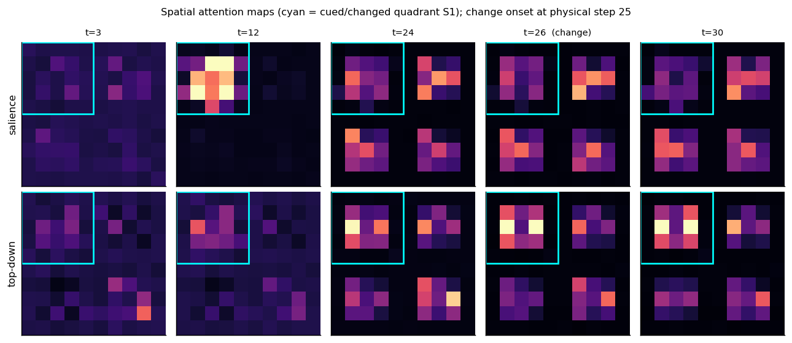

## Abstract

We analyse a parallel dual-stream recurrent vision transformer trained by reinforcement to
perform cued, value-weighted change detection under a *held-frame* protocol: each of seven
logical frames is presented for five identical physical steps, so the agent observes a thirty-five
step video in which the orientation change appears at physical step twenty-five. The architecture
carries two recurrent memories read by two parallel attention streams — a *salience* stream whose
queries are the percept and whose keys/values are the first memory, and a *top-down* stream keyed
on the second memory — whose outputs are concatenated and read by convolutional actor and critic
heads. Holding each frame turns the agent's internal dynamics into a sequence of plateaus and
jumps, which we use to read out its computation frame by frame. The trained agent is a
conservative, well-calibrated detector: it withholds almost perfectly on no-change trials and
detects supra-threshold changes graded by magnitude, with a psychometric threshold near a quarter
of the maximum orientation change. Its behaviour is value-directed — it abandons the lowest-value
cue colour — but, as in the un-repeated task, it shows no spatial cueing benefit. Faithful
attention extraction, linear decoding, and causal bias injection together show a clean division of
labour: the salience stream holds a grounded, cue-shaped read of the scene that prevents collapse,
while the top-down stream is a change-triggered gate that, when biased onto the changed location,
is the sole strong causal lever on the decision. The critic carries a near-binary, value-graded
code whose uncertainty falls with the strength of the evidence.

## 1. Introduction

A central question for models of visual attention is how an agent that is rewarded only sparsely —
for a single correct report at the end of a trial — comes to allocate internal attention in space
and time, and how that allocation relates to the decision it ultimately makes. We study this in a
recurrent vision transformer trained end-to-end by reinforcement on a Posner-style cued
change-detection task, in a *held-frame* variant designed to expose the agent's temporal dynamics.

In the standard task each video frame is a fresh draw of oriented Gabor patches plus pixel noise,
so the agent must integrate evidence across frames that are individually noisy. Here we instead
**hold each logical frame for five physical steps**: the pixels (including the noise) are frozen
within a logical frame, so five consecutive observations are identical, and a new noise draw occurs
only when the logical frame advances. The agent therefore sees a thirty-five step episode built
from seven logical frames, with the cue present from the start and the orientation change appearing
at logical frame five — physical step twenty-five. This manipulation does two things. First, it
lengthens the agent's look at each image, which empirically lets this architecture learn a task it
otherwise struggles with. Second, and more useful for analysis, it turns the recurrent state's
trajectory into a staircase: within a held frame the input is constant, so the state relaxes onto a
*plateau*; when the frame advances — and especially when the change arrives — the state *jumps*.
Reading the agent on this staircase lets us separate what is driven by fresh sensory evidence from
what is intrinsic recurrent dynamics, and aligns naturally with a view of the latent as a point
that drifts on plateaus and jumps between basins.

We ask five questions, matching the canonical deep-dive battery for this architecture. (i) What is
the agent's behavioural signature — its psychometric and chronometric functions, its sensitivity to
the cue's stated reliability, and its dependence on cue value? (ii) How is attention allocated
across the two streams over the held-frame timeline? (iii) What do the two recurrent memories
encode, and when? (iv) Which stream causally carries the decision, and which carries value? (v)
What does the distributional critic represent? We answer each with faithful, intervention-ready
measurements rather than proxies.

## 2. Methods

### 2.1 The held-frame change-detection environment

Each trial presents four oriented Gabor patches, one per quadrant (S1 top-left through S4
bottom-right), on a noisy background, with a coloured spatial cue ring whose radius encodes a
stated reliability (proportion $\in\{0.25,0.5,0.75,1.0\}$) and whose colour (red, green, blue)
sets the trial's reward value (5, 3, 1). On a change trial ($p=0.5$) one patch rotates by
$\Delta\theta$ degrees, drawn during training from $\mathrm{Unif}(-64^\circ,64^\circ)$; on a
no-change trial nothing rotates. The agent emits *wait* or *press* at each physical step. Pressing
on or after the change frame of a change trial yields the cue-colour reward (a hit); pressing
before the change, or on a no-change trial, ends the trial with zero reward (a false alarm);
**waiting out a no-change trial to the end also yields the cue-colour reward** (a correct
rejection). Overall accuracy is therefore the average of the hit rate on change trials and the
correct-rejection rate on no-change trials.

The held-frame protocol holds each of seven logical frames for five physical steps with frozen
pixels, giving a thirty-five step episode with the change at physical step twenty-five. All
analyses below are aligned to this physical timeline; reaction time is measured in physical steps
after the change onset, capturing within-frame deliberation.

### 2.2 Architecture

The agent is conv-free. Each frame is cut into a $10\times10$ grid of $5\times5\times3$ patches,
each linearly embedded to a $d=128$ token. A **parallel dual-stream encoder** carries two
per-token recurrent memories $H_1,H_2$ and runs two attention blocks each step:

- **Salience (bottom-up):** $Z_\mathrm{sal} = X + \mathrm{attn}(Q{=}X,\,K{=}V{=}H_1) + \mathrm{FFN}$, residual on the percept $X$;
- **Top-down (gating):** $Z_\mathrm{td} = H_2 + \mathrm{attn}(Q{=}X,\,K{=}V{=}H_2) + \mathrm{FFN}$, residual on the second memory $H_2$.

The memories are then updated by per-token LSTM cells, $H_1\leftarrow\mathrm{LSTM}_1(X)$ and
$H_2\leftarrow\mathrm{LSTM}_2(Z_\mathrm{sal})$. The two stream outputs are concatenated,
$[Z_\mathrm{sal}\Vert Z_\mathrm{td}]$, and read by 1-D-convolutional actor and critic heads (no
CLS token). The critic is distributional (51 quantiles). Training is PAC (MPO + behaviour cloning)
with a QR-DQN critic and prioritized episode replay. The model has roughly 1.1M parameters and
reaches an overall accuracy near 0.74 on the held-frame task.

### 2.3 Faithful attention extraction and intervention

All attention analyses use a bias-injectable replica of the encoder step that reproduces the
trained model's actor logits to within $2\times10^{-6}$, so the maps and interventions are the
agent's own computation, not a re-trained proxy. For each stream we read the pre-softmax attention
of the percept queries onto the memory keys, average over heads and queries, and pool the resulting
distribution over the four quadrants (it sums to one over the 100 keys). For causal tests we add a
scalar bias to the pre-softmax logits of a chosen stream and key region (one quadrant, or all keys
uniformly) and sweep it over $[-6,+6]$, measuring the effect on the decision (hit rate) and on
value (critic entropy).

### 2.4 Behavioural, decoding, causal and value analyses

Behaviour uses greedy rollouts under forced trial specifications (fixed cue side, validity,
magnitude, colour). Attention, decoding and value use forced-wait rollouts so the full
thirty-five-step trajectory is observed. Decoding fits cross-validated linear classifiers to the
per-quadrant-pooled memories at each physical step. Reported numbers are over hundreds of trials
per condition; the analysis is run serially on CPU.

## 3. Results

### 3.1 A conservative, value-directed detector with no spatial cueing benefit

On the natural change/no-change mix the agent reaches an overall accuracy of **0.69**, which
decomposes into a high correct-rejection rate (**0.94**), a moderate hit rate (**0.46**), and a low
false-alarm rate (**0.06**) (Figure 1a). The criterion is conservative: the agent rarely presses on
a no-change trial, paying for that caution with missed changes rather than false alarms. Detection
is graded by the physical signal — at the fully reliable cue the hit rate climbs from chance at
$0^\circ$ to about **0.60** at the largest orientation change, with a threshold near
$16$–$28^\circ$, roughly a quarter to a half of the maximum (Figure 1b). Reaction time, measured in
physical steps after the change onset, is essentially zero: once the agent detects a change it
presses on the first held step of the change frame, so the held protocol buys detection accuracy
rather than graded deliberation time.

Two classical attention signatures are then notable by their *absence* and *presence*. There is
**no spatial cueing benefit**: the psychometric and chronometric functions for valid and invalid
cues are superimposed (at the fully reliable cue, hit rates of 0.60 valid versus 0.62–0.72 invalid
across the upper magnitudes — if anything invalid is marginally higher), and hit rate at the
largest magnitude is flat across displayed cue reliability (0.60–0.73 from ring $1.0$ to $0.25$;
Figure 1c). In contrast there is a strong **value** signature (Figure 1d): at a near-threshold
magnitude the agent detects high-value changes well (red **0.88**, green **0.92**) but abandons the
lowest-value colour almost entirely (blue **0.00**). The agent reads the cue for *what the trial is
worth*, not for *where to look*.

![Behaviour of the held-frame agent. (a) Signal-detection decomposition on the natural mix: overall accuracy is the mean of a high correct-rejection rate and a moderate hit rate, with a low false-alarm rate. (b) Psychometric (solid, left axis) and chronometric (dotted, right axis) functions versus orientation-change magnitude for valid and invalid cues — a graded detection function with the valid and invalid curves overlapping. (c) Hit rate at the largest magnitude versus displayed cue reliability — flat. (d) Hit rate near threshold by cue colour — the agent abandons the lowest-value colour.](figs/fig_behaviour.png){width=100%}

### 3.2 Two streams: a grounded salience read and a change-triggered top-down gate

The held-frame timeline makes the two streams' division of labour visible as plateaus and a jump
(Figure 2). On a validly cued, fully reliable trial with the change at S1, the **salience** stream
holds a mildly cue-shaped, roughly stable read of the scene: its attention onto the cued quadrant
sits around **0.27** and barely moves through the change (0.27 before, 0.24 after), and across
quadrants it is close to uniform with a slight bias toward the cued side (S1 0.27 versus S4 0.20).
The **top-down** stream behaves oppositely: its read of S1 is flat at about **0.31** through the
pre-change plateaus and then *jumps* to **0.44–0.48** within a frame of the change, while its
attention to the other three quadrants falls to 0.15–0.20 — a clean change-lock onto the changed
location (Figure 2, right; spatial maps in Figure 4).

This lock is universal and cue-independent (Figure 3). Plotting attention onto the changed quadrant
across all eight cue conditions, the top-down jump at step twenty-five is present on every condition
regardless of validity or displayed reliability, whereas the salience stream's *pre-change* read of
that quadrant is slightly higher when it is the cued side than when it is not — a weak spatial cue
prior carried by the grounded stream, not the gate. The salience stream supplies a stable,
scene-grounded read; the top-down stream is a trigger that fires on change.

{width=100%}

{width=100%}

{width=85%}

### 3.3 What the two memories encode, and when

Linear decoding from the per-quadrant memories shows that the agent's representation tracks what it
*uses* and discards what it *ignores* (Figure 5). The **cue colour** — the trial's value, which the
agent acts on — is decodable at ceiling from the top-down memory throughout the trial (balanced
accuracy **1.00** at every step; **0.96** from the salience-fed memory at the end). The **cue
reliability** — which the agent's behaviour ignores — tells the opposite story: it is perfectly
decodable early, while the cue ring is on the screen (**1.00** at step ten), but decays to chance
(**0.25**) by the change frame. The agent perceives reliability but does not maintain it.

The **changed quadrant** is the cleanest temporal signature. With the change location randomised
independently of the cue, its decodability sits exactly at chance (**0.25–0.26**) through every
pre-change plateau and then jumps to **0.96** from the top-down memory within a frame of the change
(**0.71** from the salience-fed memory). The spatial identity of the change is therefore created at
the moment of the change and held primarily in the top-down memory — the same memory whose attention
locks onto that quadrant in §3.2.

{width=100%}

### 3.4 Which stream causally carries the decision

Injecting an attention bias into one stream at a time, and sweeping it over $[-6,+6]$ on
near-threshold change-at-S1 trials, separates the two streams by *what they control* (Figure 6).
For the **decision** (hit rate), the only lever with a non-negative effect is biasing **top-down**
attention onto the changed quadrant: at the strongest positive bias the hit rate rises to about
**0.64** from an unbiased **0.54**, while uniform gains and both salience levers leave it unchanged
or lower it (sweep effects of $+0.05$ for top-down→S1 versus $-0.05$, $-0.11$, and $-0.14$ for the
others). The decision effect is modest — near the trial-to-trial noise floor — so we read it as
*directionally* consistent with the un-repeated model rather than a large lever.

The dissociation is sharper for **value**. Biasing the **salience** stream onto the changed
quadrant strongly moves the critic's outcome uncertainty (entropy change $+0.33$ over the sweep),
whereas biasing the **top-down** stream onto the same quadrant moves the decision but leaves the
critic's uncertainty essentially untouched ($+0.001$). The two streams thus push different
variables: top-down attention nudges *whether the agent acts*, salience attention nudges *how
certain the value estimate is*.

{width=92%}

### 3.5 A calibrated, value-graded critic

Under a forced-wait policy the distributional critic carries a value-graded code (Figure 7). State
value before the change is ordered by cue colour in rough proportion to the reward on offer (red
**3.8**, green **2.2**, blue **0.4** for rewards of 5, 3, 1), with no-change trials at an
intermediate **2.0** — the value of correctly waiting for the end-of-trial reward. This is a graded,
not binary, value representation, even though the *policy* in §3.1 thresholds it into near-binary
behaviour (acting for red and green, abandoning blue).

The decision signal is value-gated in time. The press-minus-wait advantage is negative on every
plateau before the change and jumps toward press exactly at the change frame, but only for valued
trials: it crosses to positive for red (**$-0.33\to+0.04$**), rises for green (**$-0.30\to-0.07$**),
and stays negative for blue (**$-0.23$**, abandon) and for no-change (**$-0.18$**, keep waiting).
Finally the critic is **calibrated to the evidence**: its outcome uncertainty just after the change
falls monotonically as the change magnitude grows, from an entropy of **0.52** at the smallest
change to **0.10** at $44^\circ$ (with a slight uptick at the extreme). More detectable changes
leave the agent more certain of the trial's outcome.

{width=100%}

## 4. Discussion

### 4.1 A grounded stream and a triggered gate

The held-frame protocol does not change the architecture, but it makes its computation legible. The
two streams separate cleanly into a **grounded salience read** — stable across plateaus, mildly
cue-shaped, present from the start — and a **change-triggered top-down gate** that is flat until the
change and then jumps onto the changed location. Decoding (§3.3) and causal injection (§3.4) agree
with the attention maps (§3.2): the spatial identity of the change is created at the change and held
in the top-down memory, and it is the top-down stream — not the salience stream — whose bias onto
that location moves the decision. This is the same qualitative division of labour found for this
architecture on the standard un-held task, recovered here on a thirty-five-step held timeline where
the dynamics are visibly stepwise.

### 4.2 Why holding frames helps, and what the plateaus reveal

Holding each frame for five identical steps lets this conv-free agent learn a task it otherwise
struggles to learn: the frozen, repeated percept gives the recurrent state several steps to settle
before it must act, and detection accuracy — not reaction time — is what improves, since the agent
presses on the first held step once it detects. Viewed as dynamics, the trajectory is a staircase:
the state relaxes onto a plateau within each held frame and jumps when the frame advances, most
sharply at the change. The top-down gate's S1 read is the clearest instance — a flat plateau near
0.31 followed by a jump to ~0.48 — and the changed-quadrant code switches from chance to near-ceiling
across the same single step. This is exactly the plateau-and-jump picture that motivates treating the
working-memory state as a point that drifts on basins and jumps between them.

### 4.3 Representation matches use

The agent's internal code is selective in a telling way. It maintains the cue **colour**, which sets
the trial's value and which it acts on, at ceiling for the whole trial; it perceives the cue
**reliability** but lets it decay to chance, and its behaviour ignores reliability entirely (flat
psychometric across rings, no validity benefit). The critic, meanwhile, represents value as a graded
quantity ordered by reward, even though the policy collapses that graded value into near-binary
action. What the agent keeps and what it discards line up with what its policy needs — value in, an
unused spatial-reliability cue out.

### 4.4 Limitations

The causal decision effect of the top-down lever, while the only positive one, is modest and close to
the trial-to-trial noise floor on this conservative detector; we therefore present it as directional
support for the decoding and attention results rather than as a strong stand-alone lever. The agent's
hit rate on change trials is moderate (≈0.46) by design of its conservative criterion, so the
psychometric curves saturate below ceiling. Reaction time is uninformative under the held protocol
because detection is effectively immediate within the change frame; a finer-grained chronometric
analysis would require single-step (un-held) frames. Finally, this is a single trained agent of one
architecture; the cross-architecture comparison is the subject of the broader program.

## 5. Conclusion

A parallel dual-stream recurrent vision transformer, trained by reinforcement on cued, value-weighted
change detection with each frame held for five steps, solves the task as a conservative,
well-calibrated, value-directed detector with no spatial cueing benefit. The held-frame timeline
exposes a clean separation between a grounded salience stream that holds the scene and a
change-triggered top-down gate that locks onto the changed location and carries the decision, with a
critic whose graded value code is calibrated to the strength of the evidence. The agent maintains the
cue information it uses and discards the information it ignores, and its internal dynamics take the
form of plateaus punctuated by jumps at the moments that matter.
