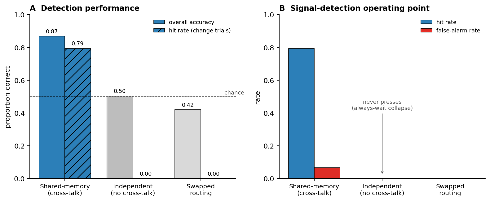

# Coupling Is Required: Cross-Talk Between Policy and Value Pathways Determines Whether a Recurrent Attention Agent Learns at All

**A report on split actor / critic recurrent pathways in the change-detection agent**

---

## Abstract

We study how the policy (actor) and value (critic) computations should be organized inside a recurrent vision-transformer agent trained to detect spatially cued orientation changes. Starting from a single shared recurrent encoder, we split the agent into two recurrent attention pathways — a *salience* pathway that reads the raw image and a *top-down* pathway that reads accumulated memory — and route one to the actor and one to the critic. We then vary a single structural property: whether the two pathways **cross-talk** through a shared recurrent memory, or run as **independent** modules that never touch each other's state.

The result is categorical. With cross-talk, the agent learns the task well: 86.8% accuracy, a 79.4% hit rate on change trials, a low 6.7% false-alarm rate, and fast ~2-frame reaction times — and it reproduces the spatial-cueing behavioral signature of primate covert attention. Remove the cross-talk and the agent **never presses a single time**: hit rate collapses to 0.0%, accuracy falls to the 50.4% no-change base rate, and the policy degenerates to "always wait." A third control — keeping the cross-talk but swapping which pathway drives the actor — collapses just as completely. Coupling between the value and policy pathways is therefore not a performance optimization; it is a precondition for the agent to acquire the task at all. We trace the mechanism to credit assignment: a shared recurrent memory forces the critic to evaluate the very state the actor acts from, and severing it decouples value from policy, leaving the actor with no coherent learning signal.

---

## 1. Introduction

A recurrent agent that allocates covert attention to detect changes must do two different things at once. It must form a *policy* — decide, frame by frame, whether to declare that a change has occurred — and it must form a *value estimate* — predict how good its current situation is, which is what supplies the policy's learning signal under an actor–critic objective. In a monolithic network these two computations share a single representation. A natural design question is whether they should instead be *separated* into distinct recurrent pathways, each specialized for its role, and if so, how tightly those pathways must remain connected.

Separation is attractive. The decision of *when to act* is driven by bottom-up, image-grounded evidence — a salient orientation change at an attended location. The estimate of *how valuable the moment is* depends more on accumulated context — which location was cued, how reliable the cue is, how much time has elapsed. One can imagine handing the first job to a "salience" pathway tied to the live image and the second to a "top-down" pathway tied to memory. The open question is whether such specialized pathways can be cut apart entirely, or whether they must remain coupled.

We answer this with a controlled architectural comparison. Holding the task, the training algorithm, and every other component fixed, we manipulate exactly one property — inter-pathway coupling — across three variants:

1. **Shared-memory (cross-talk):** the two pathways are split at the output (salience → actor, top-down → critic) but communicate through a common recurrent memory.
2. **Independent (no cross-talk):** the two pathways are split at the output *and* given private memories they never share.
3. **Swapped routing:** identical to the shared-memory variant, but the salience and top-down outputs are routed to the opposite heads.

The comparison isolates the causal contribution of coupling, in the same spirit as a lesion experiment. As we show, the contribution is all-or-nothing.

---

## 2. The agent and its three pathway configurations

**Shared substrate.** All three variants share the same front end. Each 50×50 frame is split into a 10×10 grid of patch tokens, embedded by a small per-patch network, and tagged with positional and temporal codes. Two recurrent memories, `H1` and `H2`, are maintained as per-token hidden states (one slot per patch location), updated by LSTM cells across frames. Attention is computed by cross-attention blocks in which the live image supplies the queries and memory supplies the keys and values. Two 1-D-convolutional heads — an actor producing a wait/declare logit pair and a distributional critic — read the pathway outputs. Training is identical across variants: an actor–critic reinforcement-learning objective (a maximum-a-posteriori policy-improvement actor loss with a behavior-cloning blend, a distributional value critic, a periodically refreshed target network, prioritized replay, and a brief forced-wait warm-up), with the same hyperparameters and the same number of updates.

The variants differ only in how the two recurrent pathways are wired.

**Variant 1 — Shared-memory / cross-talk.** Per frame:

- *Salience pathway* (→ actor): the image queries **both** memories, `Q = X`, `K = V = [H1 ‖ H2]`, with the raw image as the residual. Output `Z_sal`.
- *Top-down pathway* (→ critic): the image queries the deep memory, `Q = X`, `K = V = H2`, with `H2` as the residual (the image only re-weights memory; it contributes no new content). Output `Z_td`.
- *Memory update:* `H1 ← LSTM(X)` (written from the raw image); `H2 ← LSTM(Z_sal)` (written from the **salience** output).

The coupling lives in `H2`. The actor's pathway *writes* `H2` (through `Z_sal`) and *reads* it back (inside `[H1 ‖ H2]`), and the critic's pathway *reads* the same `H2`. The two heads are separated, but they sit on a shared, jointly maintained memory.

**Variant 2 — Independent / no cross-talk.** The same two pathway *types*, but each is given its own private memory and updated only by its own output:

- *Salience module* (→ actor): `Q = X`, `K = V = Hμ`, residual `X`; then `Hμ ← LSTM(Zμ)`.
- *Top-down module* (→ critic): `Q = X`, `K = V = HQ`, residual `HQ`; then `HQ ← LSTM(ZQ)`.

The two modules never touch each other's state. The only thing they share is the raw input image. This is the minimal edit that removes the cross-talk while preserving the split, the pathway types, the parameter count, and the training recipe.

**Variant 3 — Swapped routing.** Architecturally identical to Variant 1, but the readout is reversed: the top-down output drives the **actor** and the salience output drives the **critic**. This isolates whether it matters *which* pathway commands the policy, independent of the presence of coupling.

---

## 3. Results

### 3.1 Cross-talk is the difference between a competent detector and a non-learner

We evaluated each trained variant on 500 fresh cued change-detection episodes and scored standard signal-detection outcomes (hit, miss, false alarm, correct rejection), overall accuracy, and reaction time on hits.

| Configuration | Overall accuracy | Hit rate (change trials) | False-alarm rate | Reaction time | Policy phenotype |
|---|---:|---:|---:|---:|---|
| **Shared-memory (cross-talk)** | **0.868** | **0.794** | 0.067 | 1.95 frames | active, calibrated detector |
| Independent (no cross-talk) | 0.504 | 0.000 | 0.000 | — (no hits) | always-wait collapse |
| Swapped routing | 0.42 | 0.000 | 0.000 | — (no hits) | always-wait collapse |

*Figure 1. (A) Overall accuracy and hit rate on change trials for the three configurations; the dashed line marks the 50% no-change base rate. (B) Signal-detection operating point: hit rate versus false-alarm rate. The shared-memory (cross-talk) agent is a calibrated detector; both the independent and swapped-routing agents collapse to never pressing — zero hits and zero false alarms.*

The shared-memory agent is a genuine psychophysical detector. It catches roughly four out of five real changes, rarely fires on no-change trials (6.7% false alarms), and responds quickly — pressing about two frames after change onset. Its 50.4-percentage-point advantage in accuracy over the independent variant is not a matter of degree.

The independent agent does not partially learn the task — it does not learn it at all. Across 500 episodes it never once declared a change. Its hit rate is exactly zero; its accuracy, 50.4%, is precisely the rate one obtains by waiting out every trial and being correct only on the half that contain no change. The policy has retreated to the single safe action — always wait — that can never incur a false-alarm penalty, and it never discovers that declaring a change is ever worthwhile.

### 3.2 The collapse is specific to coupling, not to "having two streams"

The swapped-routing control rules out the trivial explanation that any split of policy and value into separate streams fails, or that any such split succeeds. Variant 3 *keeps* the cross-talk and the shared memory; it changes only which pathway issues the press decision. It collapses identically — zero hits, always-wait. Driving the actor from the top-down (memory-gating) pathway starves the decision of grounded image content, and the policy never finds the change. So two conditions are jointly necessary: the pathways must be **coupled** through shared memory (Variant 2 fails without it), and the **grounded salience pathway must drive the policy** (Variant 3 fails when it does not). Only the configuration that satisfies both — Variant 1 — learns.

### 3.3 The working agent reproduces the attentional cueing signature

A non-collapsed accuracy number is necessary but not sufficient evidence that the right computation emerged. The discriminating test is whether the agent shows the behavioral fingerprint of covert spatial attention: a benefit for changes at the cued location that *scales with how reliable the cue is*. Detailed characterization of the shared-memory agent confirms this signature — a graded, reliability-scaled validity benefit (larger advantage for the cued location as cue reliability rises), value-directed responding across the cue-color reward structure, and fast, change-locked decisions. The agent's behavior is organized around the cue exactly as covert attention predicts.

The two collapsed variants, by contrast, have no behavioral signature to characterize. An agent that never presses produces a flat zero hit rate at every cue reliability and every validity condition; there is no cueing effect because there is no detection. The capacity to express spatial attention is downstream of the capacity to act at all, and only the coupled architecture clears that first bar.

---

## 4. Mechanism: why coupling is required

The failure mode points directly at its cause. The independent agent does not produce noisy or biased decisions — it produces *no* decisions, and it does so from the start of training onward. That is the signature of a broken learning signal, not a broken representation.

Under an actor–critic objective, the policy improves by consulting the critic: the actor is pushed toward actions the critic values highly, evaluated **at the actor's current state**. This only works if the critic's value estimate refers to the same situation the actor is acting in. In the shared-memory agent that correspondence is enforced structurally. The actor acts from a representation built on `H2`; the critic values a representation built on the *same* `H2`; and the actor's own output is what writes `H2`. Policy and value are anchored to one evolving memory, so "pressing now looks good" is a statement about the state the actor actually occupies. Credit lands where it was earned, and the actor can discover that declaring a change at the moment of change is rewarded.

In the independent agent this correspondence is severed. The actor acts from its private memory `Hμ`; the critic values its private memory `HQ`; the two drift apart because each is updated only by its own pathway. The critic learns an accurate value of states the actor never directly experiences, and the advantage signal handed to the actor is computed on the wrong representation. The result is a policy-improvement step that is systematically misattributed. With no coherent gradient toward the press action, the actor falls into the basin that is safe under *any* value estimate — never act, never be penalized for a false alarm — and stays there. The always-wait collapse is the rational endpoint of an agent that cannot tell when acting helps.

The swapped-routing failure is the same lesson from the other side. There, value and policy *are* coupled through `H2`, but the actor is fed the top-down pathway, whose residual is memory rather than image: it carries almost no live visual content, only a re-weighting of stored state. The decision is then made from a representation that cannot see the change, so however clean the credit assignment, there is nothing in the actor's input to assign credit *to*. A working agent needs both a faithful value signal and a grounded decision variable; cutting either one returns the same degenerate policy.

---

## 5. Discussion

The headline is an architectural one: for this class of recurrent attention agent, coupling between the policy and value pathways is a structural prerequisite for learning, on par with the choice of learning signal itself. A reasonable-looking modular design — two specialized recurrent streams, cleanly separated for policy and value — does not merely underperform when the streams are isolated; it fails to acquire the task entirely. The margin between the coupled and uncoupled designs (a 79-point hit-rate gap, from competent to never-acting) is among the largest one can produce by a single structural edit.

This finding sits naturally alongside the broader thesis that primate-like attentional behavior in these models emerges only under specific, jointly necessary constraints rather than from any one component in isolation. Goal-driven reinforcement learning and memory-based gating of perception are each required; here we add a third constraint of the same character — that the policy and value computations must share a recurrent substrate. Each of these is individually insufficient and the combination is what produces a competent, attention-expressing agent. Relaxing any one of them does not degrade the behavioral signatures gracefully; it removes them.

The mechanism also has a clean interpretation in reinforcement-learning terms. The pathology of the independent design is a representation mismatch between actor and critic — a known failure mode whenever a bootstrapped value function evaluates a different state distribution than the one the policy occupies. Architectural coupling is one way to guarantee, by construction, that the critic and actor are grounded in a common state. Functionally, the shared recurrent memory plays the role of a common "workspace" that both the evaluative and the decision systems read from and write to: value shapes what is maintained, and the maintained state shapes what is decided. The collapse under decoupling suggests that, in agents that must learn *when* to act from sparse, delayed reward, keeping these systems on a shared substrate is what makes the reward usable.

Two boundary conditions sharpen the claim. First, coupling alone is not enough: the swapped-routing control shows the grounded, image-reading pathway must be the one that commands the policy. Second, the failure is a learning failure, not a capacity failure — the independent architecture has the parameters and the pathways to express the task, but the training signal it generates cannot drive them there. Both observations reinforce that the result is about the *organization* of computation, not its raw expressive power. How attention is wired, not just how much machinery it has, decides whether the behavior appears.

---

## Methods (summary)

**Task.** Spatially cued orientation-change detection. Each trial presents four oriented patches; a colored cue indicates a side (left/right) and, through its reliability (validity ∈ {0.25, 0.50, 0.75, 1.00}), the probability that an upcoming change — present on half of trials — occurs at the cued location. The agent emits a binary wait/declare action each frame; declaring at or after the change is a hit, declaring before is a false alarm, and the cue color sets the reward magnitude. Change onset is jittered across frames.

**Agent.** Conv-free patch embedding (10×10 tokens) → recurrent cross-attention encoder over per-token LSTM memories → 1-D-convolutional actor and distributional-critic heads. The three variants differ only in pathway coupling and readout routing, as described in §2; all other components, parameter counts, and the training recipe are held fixed.

**Training.** Actor–critic reinforcement learning with a MAP policy-improvement actor loss plus behavior-cloning blend, a distributional (quantile) critic, a periodically hard-copied target network, prioritized episode replay, and a short forced-wait warm-up. Each variant was trained for the same number of updates to convergence.

**Evaluation.** 500 fresh episodes per variant under a stochastic (sampled) policy. Outcomes were scored as hit / miss / false alarm / correct rejection; we report overall accuracy, hit rate on change trials, false-alarm rate on no-change trials, and reaction time (frames between change onset and the declare action) on hits. The cueing analysis splits hit rate by cue validity and reliability.

---

*Internal model references for reproducibility: Variant 1 (shared-memory / cross-talk) = `v11_part2`; Variant 2 (independent / no cross-talk) = `v11_part4`; Variant 3 (swapped routing) = `v11_part3`. Checkpoints under `~/rvit_plus_checkpoints/`.*
